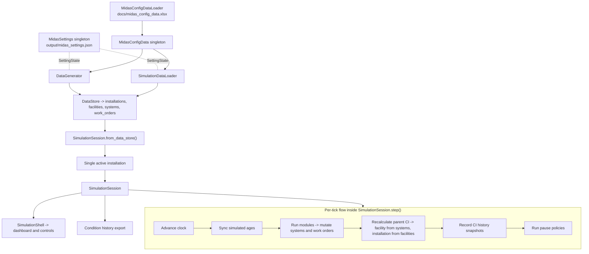

# MIDAS Simulation System Internals

Companion to [`README.md`](../README.md): user flows and file map stay there; this doc covers **runtime** shape—where data comes from, what **`SimulationSession`** owns, **`step()`** ordering, and how to add **`SimulationModuleBase`** modules without fighting derived state.

**You will use this to decide:** what to mutate in `apply()`, what the session recomputes for you, and where UI ends (`simulation_shell.py` / `simulation_shell_panels.py`) vs simulation logic.

## Package Boundaries After Refactor

The runtime now sits on top of four distinct package areas:

- `src/io/`: workbook loading, dataset import, export configuration, and file formatting.
- `src/models/domain/`: entity models, reference-data models, and `DataStore`.
- `src/models/distributions/`: weighted and event-rate distribution classes consumed by config and generation.
- `src/simulation/data_generation/`: installation/facility/system/work-order generation pipeline. `DataGenerator` is re-exported from `src.simulation`.

## One-Screen Mental Model



One installation per session; **`SimulationSession`** owns mutable runtime state for that slice.

## The Main Pieces

### Configuration and reference data

Configuration is split across two singletons:

- `MidasSettings` (`src/config/midas_settings.py`) holds every configurable runtime value as a typed `SettingState`. Defaults are documented in code; persisted overrides come from `output/midas_settings.json` on startup. Read values with `MidasSettings().get_value("<name>")`.
- `MidasConfigData` (`src/config/midas_config_data.py`) holds reference data (facility types, system types, installation locations, work-order text cache) loaded from `docs/midas_config_data.xlsx` by `MidasConfigDataLoader` in `src/io/loaders/midas_config_data_loader.py`.

Important runtime-relevant settings include:

- degradation thresholds (`condition_index_degraded_threshold`, `initial_condition_index_default`)
- facility and system age limits (`maximum_facility_age`, `maximum_system_age`)
- dependency-chain settings (`facilities_per_installation`, `dependency_chain_group_range`, `maximum_vertical_dependency_depth`)
- generation distributions (`generated_*_distribution`)
- output naming (`excel_sheet_main`, `excel_sheet_metadata`, `excel_sheet_work_orders`, `metadata_file_suffix`, `csv_table_separator`)

Generators, loaders, exporters, and the runtime session all read these singletons directly. The reference-data types (`FacilityType`, `SystemType`, `InstallationLocation`, `WorkOrderText`) live under `src/models/domain/`, and distribution implementations live under `src/models/distributions/`.

### Generated or loaded data

Before anything can run in the live simulation, MIDAS needs a `DataStore`.

`DataStore` is a flat container with four lists:

- `installations`
- `facilities`
- `systems`
- `work_orders`

`DataStore` lives in `src/models/domain/data_store.py` and is re-exported from `src.models`. It replaces the older `GenerationResult` container name used before the refactor.

Relationships are stored by IDs on the models, not by a database or ORM layer. The session rebuilds lookup maps from those IDs when it starts.

### Runtime session

`src/simulation/runtime/session.py` is the heart of the runtime.

`SimulationSession` owns:

- the active installation subset
- the simulation clock
- module and pause-policy lists
- lookup indexes for facilities, systems, and work orders
- selection state used by the shell
- condition-index history
- critical-entity tracking used by pause policies

If you are adding runtime behavior, this is the file to understand first.

### Modules

`src/simulation/modules/base.py` defines the module contract:

```python
class SimulationModuleBase(ABC):
    @abstractmethod
    def apply(self, session: SimulationSession) -> list[ModuleEvent]:
        ...
```

A module receives the active `SimulationSession`, mutates runtime state for the current tick, and can emit `ModuleEvent` records.

`ModuleEvent` carries:

- `code`
- `message`
- `entity_id`
- `entity_type`
- `should_pause`

Modules are run in list order during `SimulationSession.step()`.

### Built-in system degradation module

`src/simulation/modules/system_degradation.py` provides `SystemDegradationModule`, and it is the only module enabled by default in the runtime-module registry.

The module is intentionally narrow in scope:

- it mutates only system `condition_index`
- it resolves `SystemType` from `session.settings`
- it uses simulated system age and configured life expectancy to compute normalized age
- it scales deterioration to the active tick size
- it emits non-pausing events when a system drops into a worse condition band

The current model is passive only (no maintenance recovery, backlog penalties, or shock failures); see [`system_degradation_module.md`](system_degradation_module.md) for the full age-band hazard model and the random-event layer.

### Selecting which modules run

Which modules participate in a session is driven by `MidasSettings`, not by hardcoded CLI lists. The flow is:

1. `src/simulation/modules/registry.py` discovers every concrete `SimulationModuleBase` subclass declared under `src/simulation/modules/` (excluding `base.py` and `registry.py`). Each class is registered as a `ModuleSpec(key, label, factory, default_enabled)`; keys are derived from the class name by stripping the `Module` suffix and converting to snake_case (e.g. `SystemDegradationModule` -> `system_degradation`).
2. `MidasSettings` exposes an `enabled_simulation_modules` setting backed by a new `BooleanMappingSettingState` (a `dict[str, bool]` with display labels and a fixed key set).
3. `ApplicationState.initialize()` calls `MidasSettings.sync_simulation_module_registry()` after loading the JSON state file. Newly discovered modules are added with their `default_enabled` flag, and unknown keys (e.g. modules that were renamed or deleted) are pruned. User overrides for keys that still exist are preserved.
4. `MidasSettings.build_enabled_simulation_modules()` instantiates one module per enabled spec via `spec.factory()` and returns the list. `src/cli/handlers/simulate_handlers.py` passes that list to `SimulationSession.from_data_store(modules=...)`; the handler imports no module classes directly.
5. The setting is editable through the standard settings editor (a toggle map UI lists each module with on/off, plus quick `a` enable-all and `n` disable-all actions). Toggled state persists to `output/midas_settings.json` via the existing `save_state` flow.

`WorkOrderProgressionModule` lives in the registry but defaults to disabled; toggle it on in the settings editor to include it in subsequent runs. See [`work_order_progression_module.md`](work_order_progression_module.md) for its lifecycle schedule and repair behavior.

### Pause policies

Pause policies use the same `SimulationModuleBase` contract, but conceptually they should evaluate state instead of advancing it.

The default policy is `CriticalStatePausePolicy`, which pauses the session when an entity newly becomes:

- inoperable
- mission blocked

It tracks prior critical entities so the same failure does not trigger a pause every tick.

### Shell and dashboard

`src/cli/simulation_shell.py` runs the **`Live`** loop and key handling; `src/cli/simulation_shell_panels.py` holds Rich renderables and prompt flows. Together they reflect **`SimulationSession`** state only; keep business rules in modules or pause policies.

**Stack (top to bottom):** three summary panels (installation, simulation overview, work orders) → optional **Mission alerts** strip (red border: narrative, category counts, thresholds; **`a`** pauses and opens explainer + snapshot + “why” table + numbered drill-down to metrics, rules, sample WOs) → **Installation Graph** beside **Inspect**. Systems in the tree stay hidden until **`f`** or until a facility is focused (focus always expands that facility’s systems).

**Where to add behavior:** usually a **module**, a **pause policy**, or **session** helpers—not the shell.

## How Data Enters the Runtime

There are two supported entry paths:

1. Generate data in memory with `DataGenerator` (`src/simulation/data_generation/data_generator.py`, also re-exported from `src.simulation`)
2. Load normalized exported data with `SimulationDataLoader` (`src/io/loaders/simulation_data_loader.py`)

Both produce a `DataStore`.

When `SimulationSession.from_data_store(...)` is called, the session:

1. selects exactly one installation from the result set
2. deep-copies that single-installation subset
3. builds indexes
4. syncs simulated ages
5. recalculates aggregate condition indices
6. records the initial history snapshot at tick `0`
7. runs pause policies once against the initial state

The preferred entry point is `from_data_store`; `from_generation_result` remains as a deprecated alias. The input is a `DataStore`.

That deep copy matters: modules mutate the session-owned copy, not the caller's original result object.

## The Tick Lifecycle

This is the core runtime loop inside `SimulationSession.step()`:

1. Clear the old stop reason.
2. Advance the clock and increment the tick index.
3. Recompute cached ages from the simulated date.
4. Run each module in order.
5. Recalculate facility and installation aggregate condition indices.
6. Record condition-index history snapshots for the whole hierarchy.
7. Run pause policies.
8. If any returned event has `should_pause=True`, pause the session using the first such event message.

The subsections below spell out what that order implies for module authors.

### Modules see the new date

When `apply()` runs, the clock has already advanced. A module operates on the current tick's date, not the previous one.

### Ages are already synced

The session updates `_age_months` before modules run, so `facility.age_years`, `facility.age_months`, `system.age_years`, and `system.age_months` reflect the simulated date for the current tick.

For degradation work, that means a module can combine `system.age_months` with `session.settings.get_system_type(system.system_type_key)` to read `SystemType.life_expectancy_months` without reaching back into workbook-loading code.

### Parent condition indices are derived

Systems are the leaf-level entities with directly stored condition index values.

After modules run:

- facility CI is recomputed from child systems
- installation CI is recomputed from child facilities

This means a module should usually mutate system CI, not facility or installation CI. If you directly write a parent CI value, the session will overwrite it during aggregate recalculation unless you also change the underlying children.

### History captures post-module state

The recorded history reflects the state after modules run and after parent aggregates are recalculated.

### Pause logic runs after history capture

Pause policies evaluate the same post-module state that was just recorded in history. If something critical happens on a tick, the tick is still captured before the session pauses.

## What the Runtime Actually Tracks

### Condition index

Today, runtime history is CI-focused.

`ConditionHistoryStore` records snapshots for:

- installation CI
- facility CI
- system CI

It does not currently snapshot:

- work-order history
- resiliency-grade changes
- arbitrary module-specific state

If a future module needs historical tracking for something besides CI, that will require an additional history structure or an expanded snapshot model.

### Runtime status

`EntityRuntimeState` is the runtime summary object used by the dashboard and pause logic.

The session computes states with:

- `get_system_state(system_id)`
- `get_facility_state(facility_id)`
- `get_installation_state()`
- `iter_runtime_states()`

These methods determine whether an entity is:

- `degraded`
- `inoperable`
- `mission_blocked`

Current rules:

- degraded: `condition_index <= condition_index_degraded_threshold`
- inoperable: `condition_index <= 0`
- mission blocked for a system: inoperable and has open mission-impacting work orders
- facilities and installations inherit degraded, inoperable, and mission-blocked status from children

If you need runtime status logic in a module, prefer using these helpers instead of reimplementing the rules.

### Work orders

The session stores work orders in two ways:

- a flat list at `session.work_orders`
- a grouped lookup at `session.work_orders_by_system`

Each `System` also gets its `work_orders` list populated from that grouped lookup when indexes are rebuilt.

Open work-order statuses are:

- `Submitted`
- `Approved`
- `In Progress`

Completed work orders are not considered open.

## Authoring modules

**Leaf mutations:** change **system** `condition_index` and **work order** lifecycle fields yourself; **`session.step()`** recomputes facility/installation CI, history, and pause checks. Parent CI you set by hand is overwritten unless children change (see **Parent condition indices are derived** above).

**Structural edits:** adding/removing/relinking work orders, systems, facilities, or parent/child IDs requires consistent FK fields plus **`session.rebuild_indexes()`** so maps and **`system.work_orders`** stay aligned. Scalar-only edits do not.

**Design:** one concern per module, no UI, no direct history writes—orchestration stays in **`session.step()`**. Scale effects with **`session.current_date`** and **`session.clock.tick_size`** ( **`SystemDegradationModule`** converts tick size to a year fraction). Return **`ModuleEvent(..., should_pause=True)`** for an immediate stop; module events are processed before pause-policy events, so ordering affects which message becomes **`stop_reason`**. Prefer **`get_system_state` / `get_facility_state` / `get_installation_state`**, **`work_orders_by_system`**, and the entity lists over re-deriving status rules.

## Example Module Skeleton

This is the intended shape for a runtime module:

```python
from src.enums.entity_type import EntityType
from src.simulation.modules.base import ModuleEvent, SimulationModuleBase
from src.simulation.runtime import SimulationSession


class ExampleSystemDecayModule(SimulationModuleBase):
    def apply(self, session: SimulationSession) -> list[ModuleEvent]:
        events: list[ModuleEvent] = []

        for system in session.systems:
            if system.condition_index is None:
                continue

            system.condition_index = max(0.0, round(system.condition_index - 0.1, 2))

            if system.condition_index == 0.0:
                events.append(
                    ModuleEvent(
                        code="system_became_inoperable",
                        message=f"System {system.id} became inoperable.",
                        entity_id=system.id,
                        entity_type=EntityType.SYSTEM,
                        should_pause=False,
                    )
                )

        return events
```

The key point is that the module only mutates system state. It does not recalculate facility or installation CIs, record history, or pause the session directly.

## Generation Concepts That Still Matter at Runtime

Even if you are only working on runtime modules, it helps to know what generation creates up front.

### Dependency positions

Facilities are assigned `DependencyPosition` values such as `A1` or `B23`.

Those positions:

- define dependency depth
- carry shared group IDs
- are validated during generation so deeper facilities have valid upstream support

The shell uses those positions to build the dependency tree shown to the user.

Important nuance: the display parent shown in the shell is computed for visualization. It is not stored as a permanent parent pointer on the model.

### Resiliency grades

Facility `resiliency_grade` values are assigned during generation based on dependency relationships and configured thresholds.

At the moment, resiliency grade is useful context, but the core runtime degraded/inoperable/mission-blocked logic is driven by condition index and work-order state, not by resiliency grade.

### Lifecycle-aware work-order counts

Generated work-order volume is influenced by system age and life expectancy through the configured distributions. That gives the runtime a more realistic initial state even before any runtime modules start changing data.

## Current limitations

- **`SystemDegradationModule`** is passive and monotonic (no recovery, shocks, or work-order-driven CI yet); see **Built-in system degradation module** above.
- **History** snapshots CI only; work-order state is live-only.
- **One installation** per session; initial snapshot at tick **`0`**; **`CriticalStatePausePolicy`** ignores newly critical entities on that tick so load-generated crises do not auto-pause before playback.
- **Generation vs runtime:** work-order timestamps may use wall-clock **`datetime.now()`** at generation time, while ages follow the simulated clock during **`step()`**.
- **Stale indexes** if you change hierarchy membership without **`rebuild_indexes()`**.

## Where To Read Code First

If you are new to this part of the codebase, read these files in this order:

1. `src/simulation/runtime/session.py`
2. `src/simulation/modules/base.py`
3. `src/simulation/modules/registry.py`
4. `src/simulation/modules/system_degradation.py`
5. `src/simulation/modules/work_order_progression.py`
6. `src/simulation/runtime/clock.py`
7. `src/simulation/runtime/history.py`
8. `src/cli/simulation_shell.py`
9. `tests/integration/test_simulation_runtime_integration.py`
10. `tests/unit/test_simulation_shell_panels.py` (panel strings and mission-alert thresholds without a Live terminal loop)
11. `tests/unit/test_cli_interrupts.py` (menu and wizard behavior on Ctrl-C / EOF)

The runtime integration test is especially useful because it includes both the minimal `ForceInoperableModule` example and seeded coverage for `SystemDegradationModule`, showing how a module can mutate a system and let the rest of the runtime react automatically.
