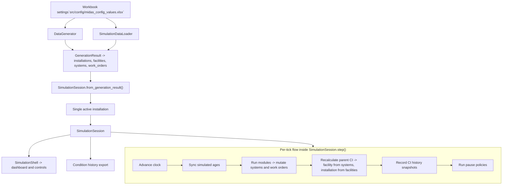
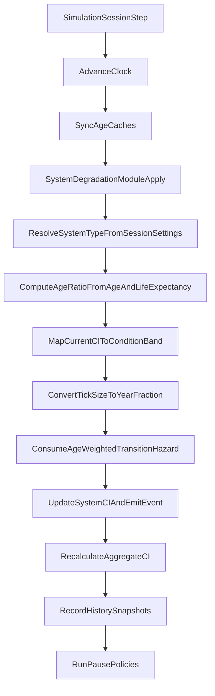
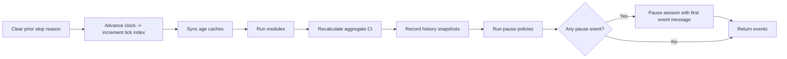

# MIDAS Simulation System Internals

This document explains how the simulation system is put together today, with an emphasis on the runtime pieces you need to understand before adding new behavior under `src/simulation/modules/`. It now includes a built-in passive system degradation module, so the runtime examples below reflect both the core session flow and that concrete module.

Use this as the companion to `README.md` when you want to answer questions like:

- Where does simulation data come from?
- What owns mutable runtime state?
- What happens on each tick?
- What should a module mutate directly?
- Which values are derived and will be recalculated automatically?

## One-Screen Mental Model



```text
Workbook Settings
  -> DataGenerator / SimulationDataLoader
  -> GenerationResult
  -> SimulationSession (exactly one active installation)
  -> step()
       1. advance clock
       2. sync simulated ages
       3. run modules
       4. recalculate parent aggregates
       5. record CI history snapshots
       6. run pause policies
  -> SimulationShell / history export
```

(Currently) The runtime simulates one installation at a time, and the `SimulationSession` is the single owner of mutable runtime state for that installation.

## The Main Pieces

### Configuration and reference data

`src/config/midas_config_values.xlsx` drives both generation behavior and several runtime rules.

Important runtime-relevant settings include:

- degradation thresholds
- facility and system age limits
- dependency-chain settings
- work-order distributions
- facility and system reference data

The settings loader builds a `MIDASSettings` object, which is passed into generators, loaders, exporters, and the runtime session.

### Generated or loaded data

Before anything can run in the live simulation, MIDAS needs a `GenerationResult`.

`GenerationResult` is a flat container with four lists:

- `installations`
- `facilities`
- `systems`
- `work_orders`

Relationships are stored by IDs on the models, not by a database or ORM layer. The session rebuilds lookup maps from those IDs when it starts.

### Runtime session

`src/simulation/runtime/session.py` is the heart of the runtime.

`SimulationSession` owns:

- the active installation subset
- the simulation clock
- module and pause-policy lists
- lookup indexes for facilities, systems, and work orders
- selection state used by the shell
- condition-index history
- critical-entity tracking used by pause policies

If you are adding runtime behavior, this is the file to understand first.

### Modules

`src/simulation/modules/base.py` defines the module contract:

```python
class Base(ABC):
    @abstractmethod
    def apply(self, session: SimulationSession) -> list[ModuleEvent]:
        ...
```

A module receives the active `SimulationSession`, mutates runtime state for the current tick, and can emit `ModuleEvent` records.

`ModuleEvent` carries:

- `code`
- `message`
- `entity_id`
- `entity_type`
- `should_pause`

Modules are run in list order during `SimulationSession.step()`.

### Built-in system degradation module

`src/simulation/modules/system_degradation.py` provides `SystemDegradationModule`, and the runtime CLI registers it by default when launching a live simulation session.

The module is intentionally narrow in scope:

- it mutates only system `condition_index`
- it resolves `SystemType` from `session.settings`
- it uses simulated system age and configured life expectancy to compute normalized age
- it scales deterioration to the active tick size
- it emits non-pausing events when a system drops into a worse condition band

The current model is passive only. It does not yet model maintenance recovery, backlog penalties, or sudden failure shocks.



### Pause policies

Pause policies use the same `Base` contract, but conceptually they should evaluate state instead of advancing it.

The default policy is `CriticalStatePausePolicy`, which pauses the session when an entity newly becomes:

- inoperable
- mission blocked

It tracks prior critical entities so the same failure does not trigger a pause every tick.

### Shell and dashboard

`src/cli/simulation_shell.py` is the UI layer over the session.

It is important to think of the shell as a consumer of runtime state, not the place where business logic should live. New simulation behavior should usually go into:

- a module
- a pause policy
- session helpers if the behavior is core runtime plumbing

## How Data Enters the Runtime

There are two supported entry paths:

1. Generate data in memory with `DataGenerator`
2. Load normalized exported data with `SimulationDataLoader`

Both produce a `GenerationResult`.

When `SimulationSession.from_generation_result(...)` is called, the session:

1. selects exactly one installation from the result set
2. deep-copies that single-installation subset
3. builds indexes
4. syncs simulated ages
5. recalculates aggregate condition indices
6. records the initial history snapshot at tick `0`
7. runs pause policies once against the initial state

That deep copy matters: modules mutate the session-owned copy, not the caller's original result object.

## The Tick Lifecycle

This is the core runtime loop inside `SimulationSession.step()`:

1. Clear the old stop reason.
2. Advance the clock and increment the tick index.
3. Recompute cached ages from the simulated date.
4. Run each module in order.
5. Recalculate facility and installation aggregate condition indices.
6. Record condition-index history snapshots for the whole hierarchy.
7. Run pause policies.
8. If any returned event has `should_pause=True`, pause the session using the first such event message.

That ordering has a few important consequences.



### Modules see the new date

When `apply()` runs, the clock has already advanced. A module operates on the current tick's date, not the previous one.

### Ages are already synced

The session updates `_age_months` before modules run, so `facility.age_years`, `facility.age_months`, `system.age_years`, and `system.age_months` reflect the simulated date for the current tick.

For degradation work, that means a module can combine `system.age_months` with `session.settings.get_system_type(system.system_type_key)` to read `SystemType.life_expectancy_months` without reaching back into workbook-loading code.

### Parent condition indices are derived

Systems are the leaf-level entities with directly stored condition index values.

After modules run:

- facility CI is recomputed from child systems
- installation CI is recomputed from child facilities

This means a module should usually mutate system CI, not facility or installation CI. If you directly write a parent CI value, the session will overwrite it during aggregate recalculation unless you also change the underlying children.

### History captures post-module state

The recorded history reflects the state after modules run and after parent aggregates are recalculated.

### Pause logic runs after history capture

Pause policies evaluate the same post-module state that was just recorded in history. If something critical happens on a tick, the tick is still captured before the session pauses.

## What the Runtime Actually Tracks

### Condition index

Today, runtime history is CI-focused.

`ConditionHistoryStore` records snapshots for:

- installation CI
- facility CI
- system CI

It does not currently snapshot:

- work-order history
- resiliency-grade changes
- arbitrary module-specific state

If a future module needs historical tracking for something besides CI, that will require an additional history structure or an expanded snapshot model.

### Runtime status

`EntityRuntimeState` is the runtime summary object used by the dashboard and pause logic.

The session computes states with:

- `get_system_state(system_id)`
- `get_facility_state(facility_id)`
- `get_installation_state()`
- `iter_runtime_states()`

These methods determine whether an entity is:

- `degraded`
- `inoperable`
- `mission_blocked`

Current rules:

- degraded: `condition_index <= condition_index_degraded_threshold`
- inoperable: `condition_index <= 0`
- mission blocked for a system: inoperable and has open mission-impacting work orders
- facilities and installations inherit degraded, inoperable, and mission-blocked status from children

If you need runtime status logic in a module, prefer using these helpers instead of reimplementing the rules.

### Work orders

The session stores work orders in two ways:

- a flat list at `session.work_orders`
- a grouped lookup at `session.work_orders_by_system`

Each `System` also gets its `work_orders` list populated from that grouped lookup when indexes are rebuilt.

Open work-order statuses are:

- `Submitted`
- `Approved`
- `In Progress`

Completed work orders are not considered open.

## What to Mutate in a Module

As a rule of thumb:

- mutate systems directly for CI changes
- mutate work orders directly for status/lifecycle changes
- let the session derive parent CIs and runtime status from those leaf changes

Good module responsibilities include:

- degrading system CI over time
- improving CI when repair conditions are met
- opening, closing, or escalating work orders
- emitting events when something noteworthy happens

Be careful with structural changes.

If a module adds, removes, or reassigns:

- work orders
- systems
- facilities
- parent-child relationships

it should also update the relevant ID fields and call `session.rebuild_indexes()` so the lookup maps and `system.work_orders` stay consistent.

If a module only changes scalar fields like `condition_index` or `status`, `rebuild_indexes()` is not needed.

## Writing Modules Safely

### Recommended pattern

Use `session.step()` as the owner of orchestration and keep modules focused on one concern each.

Good module traits:

- small scope
- predictable mutations
- no UI responsibilities
- no direct history writes
- no parent-CI bookkeeping

### Tick-size awareness

The clock can run in days, weeks, months, or years.

Modules should use:

- `session.current_date`
- `session.clock.tick_size`

to scale behavior to the active tick size instead of assuming one day per step.

`SystemDegradationModule` follows this rule by converting `TickSize` into an approximate year fraction before applying its passive deterioration hazard.

### Emit events instead of pausing manually

If a module detects something that should stop playback immediately, return a `ModuleEvent` with `should_pause=True`.

That keeps pause behavior aligned with the existing session flow and gives the session a user-facing pause reason.

Because module events are appended before pause-policy events, the first pause-worthy module event becomes the stop reason if it appears before any pause-policy event.

### Prefer derived helpers over duplicate logic

Useful session helpers for modules include:

- `session.systems`
- `session.facilities`
- `session.work_orders`
- `session.systems_by_id`
- `session.systems_by_facility`
- `session.work_orders_by_system`
- `session.get_system_state(...)`
- `session.get_facility_state(...)`
- `session.get_installation_state()`

If a module needs status counts, open work-order counts, or critical-state checks, these helpers are usually the right starting point.

## Example Module Skeleton

This is the intended shape for a runtime module:

```python
from src.enums.entity_type import EntityType
from src.simulation.modules.base import Base, ModuleEvent
from src.simulation.runtime import SimulationSession


class ExampleSystemDecayModule(Base):
    def apply(self, session: SimulationSession) -> list[ModuleEvent]:
        events: list[ModuleEvent] = []

        for system in session.systems:
            if system.condition_index is None:
                continue

            system.condition_index = max(0.0, round(system.condition_index - 0.1, 2))

            if system.condition_index == 0.0:
                events.append(
                    ModuleEvent(
                        code="system_became_inoperable",
                        message=f"System {system.id} became inoperable.",
                        entity_id=system.id,
                        entity_type=EntityType.SYSTEM,
                        should_pause=False,
                    )
                )

        return events
```

The key point is that the module only mutates system state. It does not recalculate facility or installation CIs, record history, or pause the session directly.

## Generation Concepts That Still Matter at Runtime

Even if you are only working on runtime modules, it helps to know what generation creates up front.

### Dependency positions

Facilities are assigned `DependencyPosition` values such as `A1` or `B23`.

Those positions:

- define dependency depth
- carry shared group IDs
- are validated during generation so deeper facilities have valid upstream support

The shell uses those positions to build the dependency tree shown to the user.

Important nuance: the display parent shown in the shell is computed for visualization. It is not stored as a permanent parent pointer on the model.

### Resiliency grades

Facility `resiliency_grade` values are assigned during generation based on dependency relationships and configured thresholds.

At the moment, resiliency grade is useful context, but the core runtime degraded/inoperable/mission-blocked logic is driven by condition index and work-order state, not by resiliency grade.

### Lifecycle-aware work-order counts

Generated work-order volume is influenced by system age and life expectancy through the configured distributions. That gives the runtime a more realistic initial state even before any runtime modules start changing data.

## Current Limitations and Gotchas

- The runtime now includes a built-in passive CI degradation module, but it is monotonic only: no maintenance recovery, work-order-driven effects, backlog penalties, or shock-failure behavior yet.
- History is CI-only. Work-order changes are visible in current state, but not captured as historical snapshots.
- The session simulates exactly one installation at a time.
- The initial session snapshot is recorded at tick `0` before the user starts playback.
- `CriticalStatePausePolicy` does not emit a new-critical pause event at tick `0`; it is meant to catch new transitions after the simulation begins.
- Generated work-order timestamps are created with wall-clock `datetime.now()` during generation, while runtime ages are recomputed from the simulated clock.
- If a module changes collection membership or parent-child relationships and does not rebuild indexes, lookup maps and embedded `system.work_orders` can become stale.

## Where To Read Code First

If you are new to this part of the codebase, read these files in this order:

1. `src/simulation/runtime/session.py`
2. `src/simulation/modules/base.py`
3. `src/simulation/modules/system_degradation.py`
4. `src/simulation/runtime/clock.py`
5. `src/simulation/runtime/history.py`
6. `src/cli/simulation_shell.py`
7. `tests/integration/test_simulation_runtime_integration.py`

The runtime integration test is especially useful because it now includes both the minimal `ForceInoperableModule` example and seeded coverage for `SystemDegradationModule`, showing how a module can mutate a system and let the rest of the runtime react automatically.

## Practical Guidance For The First Real Modules

The safest early modules are system-level modules that:

- read age, CI, and work-order context from the session
- update system CI
- optionally adjust work-order status
- emit events for notable changes
- rely on the session to recompute parent aggregates
- rely on pause policies for critical-state stopping behavior

A good next sequence would be:

1. tune or externalize the system CI degradation model
2. work-order progression
3. repair effects on CI
4. richer mission-impact logic

That sequence keeps new behavior aligned with the current architecture instead of pushing simulation logic into the shell or export layers.
